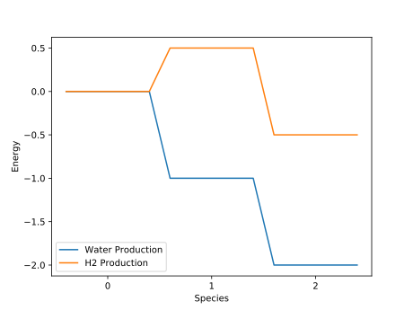

Reaction Web
============

[](https://github.com/jevandezande/reaction_web/blob/master/LICENSE)
[](https://github.com/psf/black)
[](https://github.com/jevandezande/reaction_web/actions/)
[](https://codecov.io/gh/jevandezande/reaction_web)

Chemical pathways often have a number of branches, but they are fundamentally a
set of conversions from one set of molecules to another set of molecules. This
module allows for the simple plotting of reaction webs of chemical and
electrochemical reactions. For example, the image below can be generated with the following code:

```
import matplotlib.pyplot as plt

from reaction_web import EReaction, Molecule, Path, Reaction, Web, diagram

proton = Molecule("H+", 1, 1)
H = Molecule("H", 0, 2)
H2 = Molecule("H2", -1, 1)
O = Molecule("O", 0, 3)
H2O = Molecule("H2O", -2, 1)

r1 = EReaction([proton], [H], ne=1, ref_pot=-1.5)
r2 = Reaction([H] * 2, [H2])
r3 = Reaction([H2, O], [H2O])

# H + H -> H2 && H2 + O -> H2O
p1 = Path([r2, r3], "Water Production")
# H+ + e- -> H && H + H -> H2
p2 = Path([r1, r2], "H2 Production")

web = Web([p1, p2])
diagram.plot_web(web)
plt.savefig("Water_vs_H2.svg")
```



See [examples/h2_production.py](examples/h2_production.py) for usage.


Contributions
-------------
Pull requests to add new features are welcome, just please don't add unnecessary complexity.
